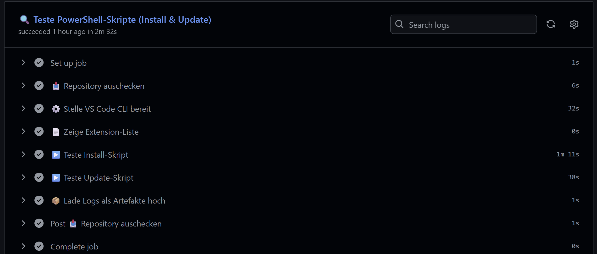
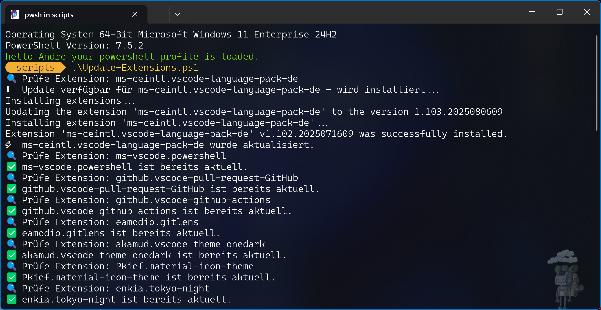

# 🚀 VSCode Extension Updater


Ein automatisiertes PowerShell-Tool zur Verwaltung und Aktualisierung von Visual Studio Code-Erweiterungen – inklusive GitHub Actions-Workflows, Logging, Failback-Strategien und Schulungsbeispielen.

---

## 📝 Inhaltsverzeichnis

- [🚀 Projektüberblick](#-projektüberblick)
- [📸 Screenshots](#-screenshots)
- [⚙️ Installation](#️-installation)
- [🚀 Verwendung](#-verwendung)
- [✨ Features & Highlights](#-features--highlights)
- [🧰 Voraussetzungen](#-voraussetzungen)
- [📁 Projektstruktur](#-projektstruktur)
- [🔄 GitHub Workflows](#-github-workflows)
- [📜 Lizenz](#-lizenz)
- [🧾 Changelog](#-changelog)
- [💬 Feedback & Support](#-feedback--support)

---

## 🚀 Projektüberblick

Dieses Projekt bietet zwei PowerShell-Skripte zur Verwaltung von VS Code Extensions:

- `Install-Extensions.ps1` – für die initiale Installation definierter Erweiterungen
- `Update-Extensions.ps1` – für die automatische Update-Prüfung & Installation

Die GitHub Workflows ermöglichen es zusätzlich, diese Logik im CI/CD-Kontext auszuführen – z. B. für Schulungen, Demos, automatisierte Tests oder Entwicklungsszenarien.

---

## 📸 Screenshots

### 1. GitHub Actions Workflow (Validierung & Test)



---

### 2. PowerShell-Terminal: Update-Extensions.ps1



---

## ⚙️ Installation

Die Installation erfolgt manuell durch das Klonen des Repositories und Ausführen der Skripte.

```powershell
# Repository klonen
git clone https://github.com/AndreHohenstein/vscode-extension-updater.git
cd vscode-extension-updater/scripts

# PowerShell-Skripte ausführen
./Install-Extensions.ps1
./Update-Extensions.ps1
```

---

## 🚀 Verwendung

```powershell
# Extensions installieren (z. B. nach Clean-Setup oder auf Testsystem)
./Install-Extensions.ps1 -LogPath "$env:TEMP\\vscode-extensions-install.log"

# Extensions aktualisieren
./Update-Extensions.ps1 -LogPath "$env:TEMP\\vscode-extensions-update.log"
```

---

## ✨ Features & Highlights

| Symbol | Funktion                                   |
| ------ | ------------------------------------------ |
| 🔍     | Prüfen installierter Erweiterungen         |
| ⚡      | Automatisches Update veralteter Add-ons    |
| 🗒️    | CMTrace-kompatibles Logging                |
| 🤖     | GitHub Actions Workflows                   |
| 🧪     | Demo-Workflow für Schulungen               |
| 🧰     | Failback-Strategie: User → System → Winget |

---

## 🧰 Voraussetzungen

- Windows 10/11 mit PowerShell 5.1 oder höher
- Visual Studio Code lokal installiert (User- oder System-Installer)
- Git (für Repository-Zugriff)

Optional:

- Winget (für Failback-Funktion, falls VS Code nicht vorhanden ist)

---

## 📁 Projektstruktur

```
📁 scripts
 ├── 📜 Install-Extensions.ps1
 └── 📜 Update-Extensions.ps1

📁 .github/workflows
 ├── 🧪 install-only.yml
 ├── ⚙️ build-extensions.yml
 └── ✅ validate-extensions.yml

📁 assets
 ├── GitHubActions.png
 └── Update-Extensions.png

📜 README.md
📜 LICENSE.md
📜 CHANGELOG.md
```

---

## 🔄 GitHub Workflows

Die folgenden Workflows unterstützen automatisiertes Testen und Validieren:

| Workflow-Datei            | Beschreibung                             |
| ------------------------- | ---------------------------------------- |
| `validate-extensions.yml` | Prüft das Update-Skript im GitHub Runner |
| `build-extensions.yml`    | Validiert Build-Szenarien & CLI-Pfade    |
| `install-only.yml`        | Demo-Workflow für Trainingsumgebungen    |

---

## 📜 Lizenz

Dieses Projekt steht unter der [MIT-Lizenz](LICENSE.md). Frei verwendbar – auch für eigene Projekte & Schulungsunterlagen.

---

## 🧾 Changelog

Alle Änderungen werden im [CHANGELOG.md](CHANGELOG.md) dokumentiert.

---

## 💬 Feedback & Support

Für Fragen, Verbesserungsvorschläge oder Rückmeldungen:

📧 E-Mail: a.hohenstein@outlook.com  
📢 GitHub Issues: [Projekt-Issuebereich öffnen](https://github.com/AndreHohenstein/vscode-extension-updater/issues)  
👨‍🏫 Einsatz für Schulungen & Community willkommen!

---

© 2025 André Hohenstein – Microsoft Certified Trainer 💻
